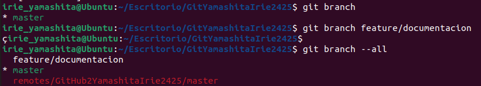
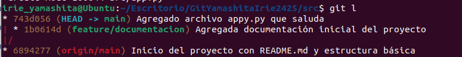
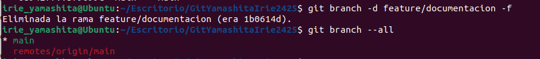
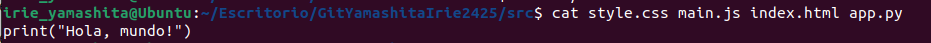

El proyecto consiste en crear y administrar un repositorio siguiendo las instrucciones de un compañero.

Irie Yamashita López   1r DAWe
# Actividad: Remoto y repaso de comandos anteriores

### **Parte 1: Preparación del Proyecto**
1. **Crear directorios y archivos:**  
   - Desde tu carpeta principal (`~/`), crea un directorio llamado `GitApellido1Nombre2425`.  

```bash
mkdir GitYamashitaIrie2425
```

   - Dentro del directorio `GitApellido1Nombre2425`, crea una subcarpeta llamada `src` usando rutas relativas.

```bash
mkdir GitYamashitaIrie2425/src
```
   - Crea un archivo `README.md` en `GitApellido1Nombre2425` con una breve descripción del proyecto, **usa costantemente el terminal**.

```bash
cd GitYamashitaIrie2425/
touch README.md
nano README.md
```


Captura apartat:  
  

---


2. **Inicializa Git:**  
   - Entra en el directorio y conviértelo en un repositorio Git.
```bash
git init . 
```

   - Agrega un archivo `.gitignore` y configúralo para ignorar [archivos de log y carpetas de configuración temporales.](https://www.atlassian.com/es/git/tutorials/saving-changes/gitignore)
```bash
touch .gitignore
nano .gitignore
```


   - ¿Qué es el archivo `.gitignore` y para que sirve?  
El archivo `.gitignore` nos sirve para especificar a git que archivos o directorios tiene que ignorar.

   - Crea una estructura básica de web `index.html`, `style.css`, `main.js`.

```bash
cd src/
touch index.html style.css main.js
ls #comprobación
```

   Capturas apartado:
   
   
   

3. **Primera confirmación:**  
   - Haz un `git add` de todos los archivos y realiza un commit inicial con el mensaje:  
     `Inicio del proyecto con README.md y estructura básica`.
```bash
git add .
git cm -m "Inicio del proyecto con README.md y estructura básica"
git l #comprobación
```


---
### **Parte 2: Colaboración en Equipo**
---
1. **Configura del repositorio remoto:**  
   - Entra en GitHub y crea un repositorio.

   - ¿Qué pasa si creo un repositorio con el archivo `README.md` desde GitHub?
Pues que se me creará automático un repositorio con un archivo tipo .md llamado README.


   - ¿Qué pasa si crea un repositorio sin el archivo `README.md` desde GitHub?
Se creará un repositorio vacío, sin ningún archivo.


   - Explica las diferencias entre las 2 preguntas anteriores.
Uno tiene un archivo README.md y el otro no. Para que suceda tenemos que activar o desactivar la 


   - Indica que comandos te da GitHub al crear un repositorio. Los encontrarás en el apartado `…or create a new repository on the command line.  

Los comandos son:
* echo "# repositorioSinReadME" >> README.md
* git init
* git add README.md
* git commit -m "first commit"
* git branch -M main
* git remote add origin https://github.com/irie-yamashita/repositorioSinReadME.git
* git push -u origin main


`
   - Vincula el repositorio remoto con el repositorio local.
```bash
git remote add origin https://github.com/irie-yamashita/GitHub2YamashitaIrie2425.git
git branch -M main #canvio el nom de la branca master a main

git push -u origin main
```
   
   
   


2. **Actualización del Proyecto:**
* Crea una nueva rama llamada `feature/documentacion` y cámbiate a ella.:
```bash
git branch feature/documentacion
git branch --all #comprobación
```


* Cambia a la nueva rama:
```bash
git ch feature/documentacion
```

      * Crea un archivo `docs.md` en la carpeta raíz. **Escribe un resumen de las funcionalidades del proyecto**.  
```bash
touch docs.md
```


* Haz un commit con el mensaje: `Agregada documentación inicial del proyecto`.    

```bash
git add .
git cm -m "Agregada documentación inicial del proyecto"
git l #comprobación
```


* Cambia a la rama `main` y usa `git diff` para comparar las diferencias entre `main` y `feature/documentacion`.  
```bash
git ch main
git diff main..feature/documentacion
```


3. **Sincronización:**  
* Desde la rama `main`, realiza un `git pull` para simular la descarga de cambios del remoto. Si hay conflictos, resuélvelos.
```bash
git pull GitHubYamashitaIrie2425 main
Username for 'https://github.com': irie-yamashita
Password for 'https://irie-yamashita@github.com': *TOKEN*
```


---
### **Parte 3: Gestión de Archivos y Cambios**
---
1. **Ediciones rápidas:**  
* Crea un nuevo archivo llamado `src/app.py` con un mensaje básico (`print("Hola, mundo!")`).  
```bash
touch src/app.py
echo print("Hola, mundo!") > src/app.py
cat src/app.py #comprobación
```
o

```bash
touch src/app.py
nano app.py
print("Hola, mundo!")
cat src/app.py #comprobación
```
  
  

* Haz un `add` y luego un `commit`. Verifica su estado con `status` o con algún comando alias que hayas creado tú
```bash
git s # alias equivalente a git status --short
git add .
git s # alias equivalente a git status --short
git cm -m "Agregado archivo appy.py que saluda"
```
  

* Visualiza el historial de `commit` con `log` o con algún comando alias que hayas creado tú.
```bash
git l #comprobación #equivalente a log --oneline --decorate --all --graph
```
  

* Si has utilizado comandos alias, indica el equivalente al comando alias. Por ejemplo, mi comando alias `git s` es igual al comando `git status --short`.
   *    s = status --short
   *    l = log --oneline --decorate --all --graph  
 
2. **Borrado y recuperación:**
* Borra el archivo `src/app.py` usando un comando de terminal. Recupera el archivo con el comando necesario, lo vimos la semana pasada.
```bash
rm -r app.py
```  
Recuperar:
```bash
git checkout HEAD src/app.py
```  
[link amb explicació](https://recoverit.wondershare.es/file-recovery/recover-files-from-local-repository-git.html)  

  

3. **Combina ramas:**  
* Desde `main`, haz un merge de `feature/documentacion`.
```bash
git merge feature/documentacion
```

* Usa `log` o un alias para verificar los cambios realizados y el historial.
```bash
git l
```
 
  
 
### **Parte 4: Entrega del Proyecto**
1. **Últimos pasos:**  
* Asegúrate de que todos los archivos estén en su lugar y realiza un `push` final al remoto.
Archivos en su lugar:  
```bash
tree
git s
```
Push:  
```bash
git push GitHubYamashitaIrie2425 main
Username for 'https://github.com': irie-yamashita
Password for 'https://irie-yamashita@github.com': *TOKEN*
```
  
  

* Realiza una limpieza eliminando la rama `feature/documentacion`.
```bash
git branch -d feature/documentacion -f
```
  

2. **Explora el proyecto desde el terminal:**  
* Usa el comando necesario de Linux para listar el contenido de cada directorio.
```bash
ls -R
```
  

* Muestra el contenido de los archivos finales con el comando necesario de Linux.
```bash
cat 
```

  

---
# ALIAS
```bash
[alias]
        s = status --short
        ch = checkout
        l = log --oneline --decorate --all --graph
        last = log -1 --color=always --format='%C(yellow)%h%Creset %C(green)%s%Creset -> %C(blue)%an%Creset (%ad)'
        cm = commit

```
